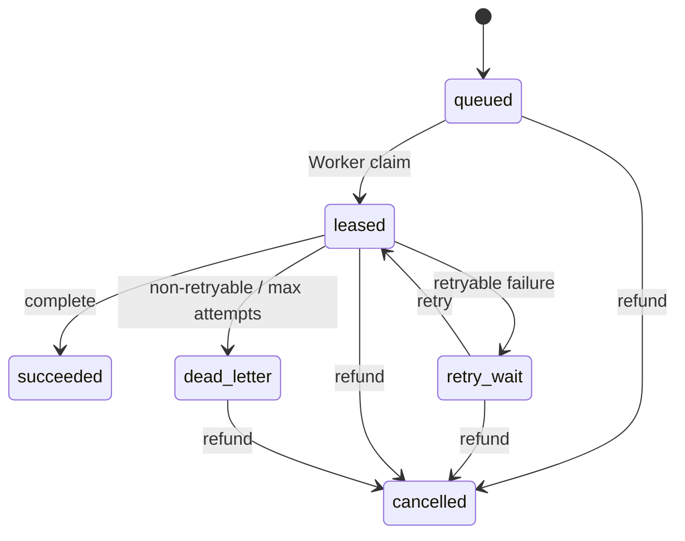

# PASSMATE NAS Worker Job Contract

## Goal

NAS는 인터넷에서 요청을 받는 서버가 아니다.

**NAS Worker가 Supabase에 outbound polling**하여 작업을 가져가고, lease를 소유한 동안만 PDF 작업을 수행한다.

```text
Vercel / Supabase
       │
       │ queued job
       ▼
Supabase issuance_jobs
       ▲
       │ outbound claim / heartbeat / result
       │
NAS Docker Worker
       │
       ├─ MASTER read
       ├─ PDF processing
       ├─ SHA-256
       └─ output upload
```

NAS 자체를 public internet에 노출하지 않는다.

---

## 1. One job = one order item artifact

초기 규칙:

```text
order_item + product_version + artifact_code(bundle) + generation(1)
= one issuance job
```

동일 job의 일시적 실패는 **새 job을 만들지 않고 같은 row를 retry**한다.

중복 생성 방지는 DB unique key로 보장한다.

---

## 2. Queue lifecycle



### Statuses

| Status | Meaning |
|---|---|
| `queued` | 작업 가능 |
| `leased` | 특정 Worker가 임시 소유 |
| `retry_wait` | 재시도 대기 |
| `succeeded` | 출력물 생성 완료 |
| `dead_letter` | 자동 재시도 종료, 관리자 확인 필요 |
| `cancelled` | 환불 등으로 작업 취소 |

---

## 3. Atomic claim

Worker는 row를 직접 SELECT해서 가져가면 안 된다.

반드시 DB RPC `claim_issuance_job()`을 사용한다.

DB는 `FOR UPDATE SKIP LOCKED` 방식으로 한 Worker만 job을 claim하게 한다.

claim 시:

- `attempt_count + 1`
- 새로운 `lease_token`
- `lease_owner = worker_id`
- `lease_expires_at` 설정
- order fulfillment를 `issuing`으로 집계

기본 lease: **300초**

heartbeat: **60초**

Worker가 죽으면 lease 만료 후 다른 Worker가 다시 claim할 수 있다.

---

## 4. Claim payload

NAS에 전달되는 최소 데이터:

```json
{
  "schema_version": 1,
  "job_id": "uuid",
  "lease_token": "uuid",
  "attempt": 1,
  "generation": 1,
  "order_id": "uuid",
  "order_item_id": "uuid",
  "product_code": "PM-C2",
  "product_version": "2027-v1.0",
  "edition_year": 2027,
  "artifact_code": "bundle"
}
```

### PII prohibition

claim payload에는 아래 정보를 넣지 않는다.

- 이름
- 이메일
- 전화번호
- 주소
- 생년월일

Worker는 PDF 생성에 필요하지 않은 고객 개인정보를 알 필요가 없다.

---

## 5. Heartbeat

작업이 lease 시간보다 길어질 수 있으므로 Worker는 60초마다:

`renew_issuance_lease(job_id, lease_token, worker_id)`

를 호출한다.

반환값이 `false`이면 Worker는 lease를 잃은 것이다.

그 경우:

1. 현재 결과를 완료 처리하지 않는다.
2. 임시 output을 폐기한다.
3. `complete` RPC를 호출하지 않는다.

이 규칙으로 zombie Worker가 오래된 결과를 덮어쓰는 것을 막는다.

---

## 6. Successful completion

Worker가 성공하면:

```json
{
  "job_id": "uuid",
  "lease_token": "uuid",
  "storage_key": "issued/PM-C2/2027/...pdf",
  "sha256": "64-char lowercase hex",
  "size_bytes": 1842031
}
```

DB RPC:

`complete_issuance_job(...)`

완료 조건:

- 현재 status가 `leased`
- lease_token 일치
- lease 만료 전
- sha256 형식 정상
- storage_key 존재

성공 시 job → `succeeded`.

모든 주문 item job이 성공하면 order fulfillment → `ready`.

---

## 7. Failure

Worker failure payload:

```json
{
  "job_id": "uuid",
  "lease_token": "uuid",
  "error_code": "STORAGE_UPLOAD_FAILED",
  "retryable": true,
  "error_detail": "short operational detail"
}
```

### Retry policy

| Attempt | Retry delay |
|---:|---:|
| 1 | 1 min |
| 2 | 5 min |
| 3 | 15 min |
| 4 | 60 min |
| 5 | dead letter |

retryable failure이고 남은 attempt가 있으면 `retry_wait`.

non-retryable 또는 최대 횟수 도달이면 `dead_letter`.

---

## 8. Error taxonomy

### Retryable by default

- `NETWORK_ERROR`
- `STORAGE_UPLOAD_FAILED`
- `PDF_PROCESS_FAILED`
- `HASH_FAILED`

### Non-retryable by default

- `MASTER_NOT_FOUND`
- `MASTER_VERSION_MISMATCH`
- `INVALID_JOB`
- `LEASE_LOST`
- `ORDER_NOT_PAID`

Worker가 무작정 모든 오류를 재시도하지 않도록 한다.

---

## 9. Refund behavior

환불은 order state machine에서:

```text
paid -> refunded
fulfillment -> revoked
```

으로 처리한다.

그 순간 아직 완료되지 않은 issuance job:

- queued
- retry_wait
- leased
- dead_letter

은 `cancelled` 처리한다.

이미 작업 중인 Worker가 있어도 lease가 무효화되므로 이후 completion이 거절된다.

---

## 10. Order-level fulfillment aggregation

주문에 PDF가 여러 개 있을 수 있다.

집계 우선순위:

```text
dead_letter exists  -> failed
leased exists       -> issuing
queued/retry exists -> queued
all succeeded       -> ready
no jobs             -> not_started
```

따라서 첫 파일이 완료되고 두 번째 파일이 아직 queue에 있으면:

```text
issuing -> queued
```

가 가능하다.

---

## 11. Audit

`issuance_job_events`에 job 상태 변경을 자동 기록한다.

운영자는 향후 다음을 추적할 수 있다.

- 어떤 Worker가 claim했는가
- 몇 번째 attempt인가
- 언제 retry_wait/dead_letter가 되었는가
- 어떤 error code였는가
- 언제 성공했는가

고객 UI에는 이 정보를 노출하지 않는다.

---

## 12. Worker loop

```text
loop:
  reap expired max-attempt jobs
  claim one job

  if none:
    sleep 10s
    continue

  start heartbeat every 60s
  process MASTER
  create output
  hash output
  upload output

  if success:
    complete_issuance_job

  if failure:
    fail_issuance_job
```

---

## Source of Truth

- Contract JSON: `config/issuance-job-contract.json`
- TypeScript types: `lib/issuance-job.ts`
- DB queue/RPC: `supabase/migrations/0004_issuance_jobs.sql`
- DB tests: `supabase/tests/issuance_job_contract.sql`
- CI validation: `scripts/validate-issuance-job-contract.mjs`
## P0 stale-worker safety addendum

When `renew_issuance_lease()` reports `false`, the Worker must not complete the job and must leave any deterministic published final object untouched. `discard()` is reserved for unpublished local temporary output; it must never delete a shared final Storage key. Cleanup of an orphaned shared key requires an ownership-aware server lifecycle, separate from stale-worker error handling.
