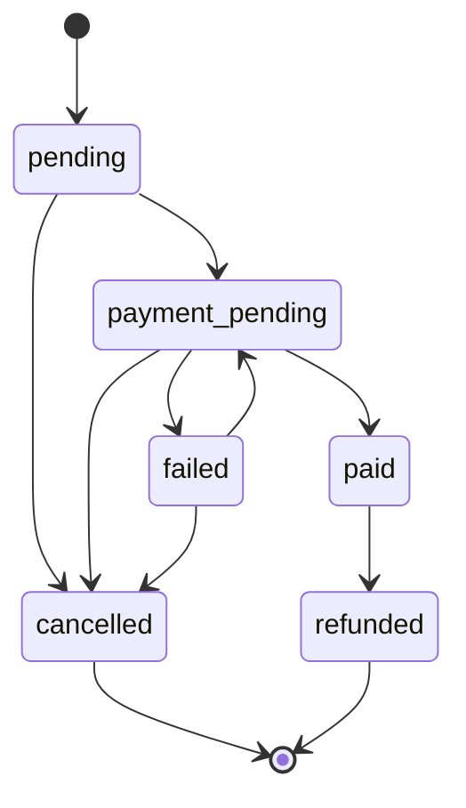
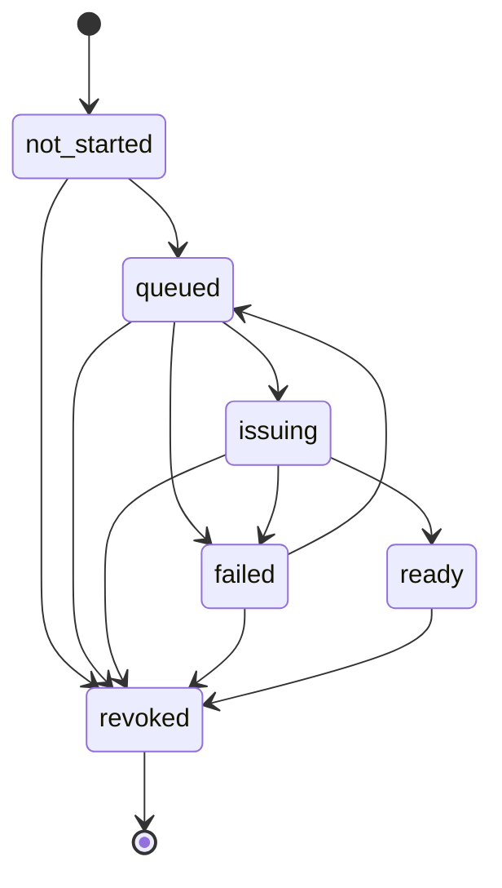

# PASSMATE Order State Machine

## Decision

PASSMATE는 **주문/결제 상태**와 **자료 발행 상태**를 하나의 status에 섞지 않는다.

이유:

- 결제는 성공했지만 PDF 발행이 실패할 수 있다.
- 자료 발행이 완료된 뒤에도 환불될 수 있다.
- NAS 재시도는 결제 상태를 바꾸면 안 된다.
- 고객지원에서 "결제 문제"와 "발행 문제"를 즉시 분리할 수 있어야 한다.

따라서 `orders.status`와 `orders.fulfillment_status` 두 축으로 관리한다.

---

## 1. Order / Payment State



### States

| Status | Meaning | Retry |
|---|---|---|
| `pending` | 주문 레코드 생성 | - |
| `payment_pending` | PG 결제 진행/검증 중 | 가능 |
| `paid` | 서버에서 결제 검증 완료 | 결제 재시도 금지 |
| `failed` | 결제/주문 처리 실패 | `payment_pending`으로 재시도 가능 |
| `cancelled` | 결제 완료 전 취소 | terminal |
| `refunded` | 결제 완료 후 전액 환불 | terminal |

### Important rule

**결제 완료 주문은 cancelled로 보내지 않는다.**

`paid -> refunded`만 허용한다.

---

## 2. Fulfillment State



| Status | Meaning |
|---|---|
| `not_started` | 발행 전 |
| `queued` | NAS Worker 작업 대기 |
| `issuing` | PDF 생성/처리 중 |
| `ready` | 고객 자료 준비 완료 |
| `failed` | 발행 실패, 재시도 가능 |
| `revoked` | 환불 등으로 접근 종료 |

---

## 3. Cross-state Invariants

### unpaid / failed / cancelled order

```text
order.status != paid/refunded
fulfillment_status = not_started
```

결제가 검증되기 전에는 발행 Queue에 넣지 않는다.

### paid order

```text
status = paid
fulfillment_status =
  not_started | queued | issuing | ready | failed
```

### refunded order

```text
status = refunded
fulfillment_status = revoked
```

환불 시 한 transaction에서 주문을 `refunded`로 만들고 발행 상태도 `revoked`로 변경한다.

---

## 4. State Version

각 order는 `state_version`을 가진다.

상태 변경 시:

```text
state_version = state_version + 1
```

향후 API/Worker는 업데이트 시 기존 version을 조건으로 사용한다.

예:

```text
UPDATE orders
SET fulfillment_status = 'issuing'
WHERE id = :order_id
  AND fulfillment_status = 'queued'
  AND state_version = :expected_version;
```

업데이트된 row가 0이면 다른 Worker/요청이 먼저 처리한 것으로 간주한다.

이 방식으로 중복 NAS 작업과 race condition을 줄인다.

---

## 5. Automatic Audit Trail

상태가 바뀔 때 `order_state_events`에 자동 기록한다.

기록 정보:

- order_id
- before / after order status
- before / after fulfillment status
- state_version
- actor_user_id
- actor_type
- failure_code
- created_at

고객 화면에는 노출하지 않고 운영/장애 분석에만 사용한다.

---

## 6. Failure Semantics

### Payment failure

```text
payment_pending -> failed
fulfillment_status stays not_started
```

다시 결제할 경우:

```text
failed -> payment_pending
```

### PDF issuance failure

```text
status stays paid
issuing -> failed
```

재시도:

```text
failed -> queued
```

따라서 "돈은 정상 결제됐는데 PDF 발행만 실패한 주문"을 결제 실패로 잘못 표시하지 않는다.

---

## 7. Customer-facing wording

내부 상태명을 그대로 고객에게 노출하지 않는다.

예:

- `paid + queued/issuing` → **자료 준비 중**
- `paid + ready` → **다운로드 가능**
- `paid + failed` → **자료 준비 지연**
- `refunded + revoked` → **환불 완료**

내부 NAS, fingerprint, security code 등의 용어는 고객 UI에서 사용하지 않는다.

---

## Source of Truth

- Contract: `config/order-state.json`
- TypeScript helpers: `lib/order-state.ts`
- DB enforcement: `supabase/migrations/0003_order_state_machine.sql`
- DB tests: `supabase/tests/order_state_machine.sql`
- CI contract validation: `scripts/validate-order-state.mjs`
